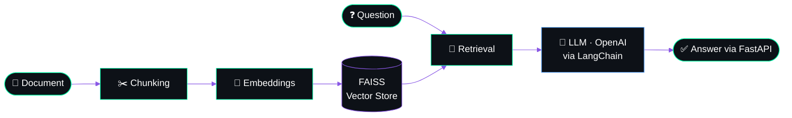
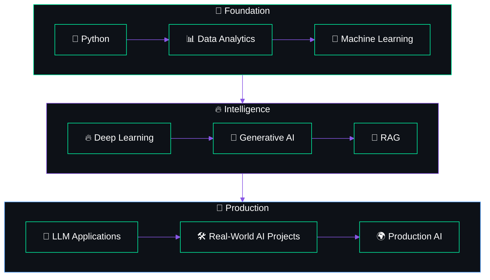

```mermaid
%%{init: {'theme':'base','themeVariables':{'lineColor':'#8957e5','primaryTextColor':'#ffffff','primaryColor':'#0d1117','primaryBorderColor':'#00f7a5','edgeLabelBackground':'#0d1117'}}}%%
flowchart LR
    A["🐍 Python"] --> B["📊 Pandas · NumPy"]
    B --> C["🧠 Scikit-learn<br/>TensorFlow · PyTorch"]
    C --> D["🤖 LangChain · OpenAI<br/>FAISS · RAG"]
    D --> E["⚡ FastAPI · Flask"]
    E --> F["🐳 Docker · AWS · GCP"]

    style A fill:#0d1117,stroke:#3776AB,color:#fff
    style B fill:#0d1117,stroke:#58a6ff,color:#fff
    style C fill:#0d1117,stroke:#F7931E,color:#fff
    style D fill:#0d1117,stroke:#8957e5,color:#fff
    style E fill:#0d1117,stroke:#009688,color:#fff
    style F fill:#0d1117,stroke:#2496ED,color:#fff
```
 

<!-- 🧑‍💻 ANIMATED DEV CARTOON -->

  

 

  

 

  

  

<table width="100%">
<tr>
<td align="center" valign="top" width="50%">

 

  
</td>
<td align="center" valign="top" width="50%">

 

  
</td>
</tr>
<tr>
<td align="center" valign="top" width="50%">

 

  
</td>
<td align="center" valign="top" width="50%">

 

  
</td>
</tr>
<tr>
<td align="center" valign="top" width="50%">

 

  
</td>
<td align="center" valign="top" width="50%">

 

  
</td>
</tr>
<tr>
<td align="center" valign="top" width="50%">

 

  
</td>
<td align="center" valign="top" width="50%">

 

  
</td>
</tr>
</table>

 

<table>
<tr>
<td align="center" width="33%">

### 🛒 Deal Corner
**Online Price Comparison Platform**

Compare products and prices across multiple e-commerce platforms.

</td>
<td align="center" width="33%">

### 🛡️ INFADE
**Insurance Fraud Detection System**

Machine Learning based system for detecting potentially fraudulent insurance claims.

</td>
<td align="center" width="33%">

### 📄 DocuMind
**AI Document Understanding System**

AI-powered document processing and question-answering using LLM and RAG architecture.

</td>
</tr>
</table>

<!-- Har project ke neeche link chahiye toh: [🔗 View Repo](https://github.com/akarshsrvt/REPO-NAME) -->

<b>🔍 DocuMind — click to see the flow</b>

<b>🔍 INFADE — click to see the flow</b>

<b>🔍 Deal Corner — click to see the flow</b>

 

 
 
 
 
 
 

 

  

 

 

 

 

  

